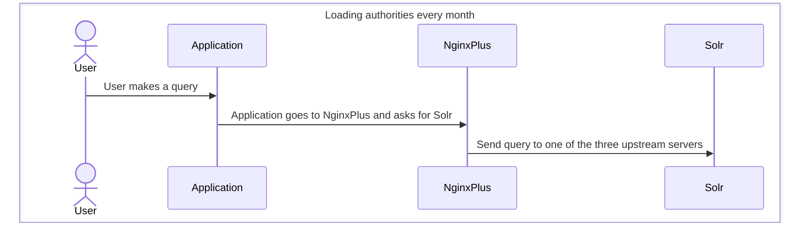

# Solr Network Flow

## Flow Diagrams

```mermaid
sequenceDiagram
    box Loading authorities every month
      actor User
      participant Application
      participant NginxPlus
      participant Solr
    end
        User->>Application: User makes a query
        Application->>NginxPlus: Application goes to NginxPlus and asks for Solr
        NginxPlus->>Solr: Send query to one of the three upstream servers


```
