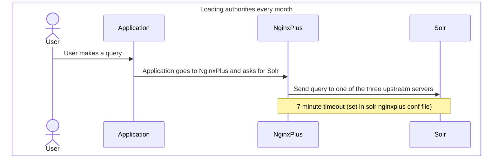

# Solr Network Flow

## Flow Diagrams

## Application timeouts

| Application | timeout value | timeout source | set or default |
| ----------- | ------------- | -------------- | -------------- |
| Digital Collections | 15_000 milliseconds | [Finch, via Req](https://finch.hexdocs.pm/0.23.0/Finch.html#t:request_opt/0) | default |

